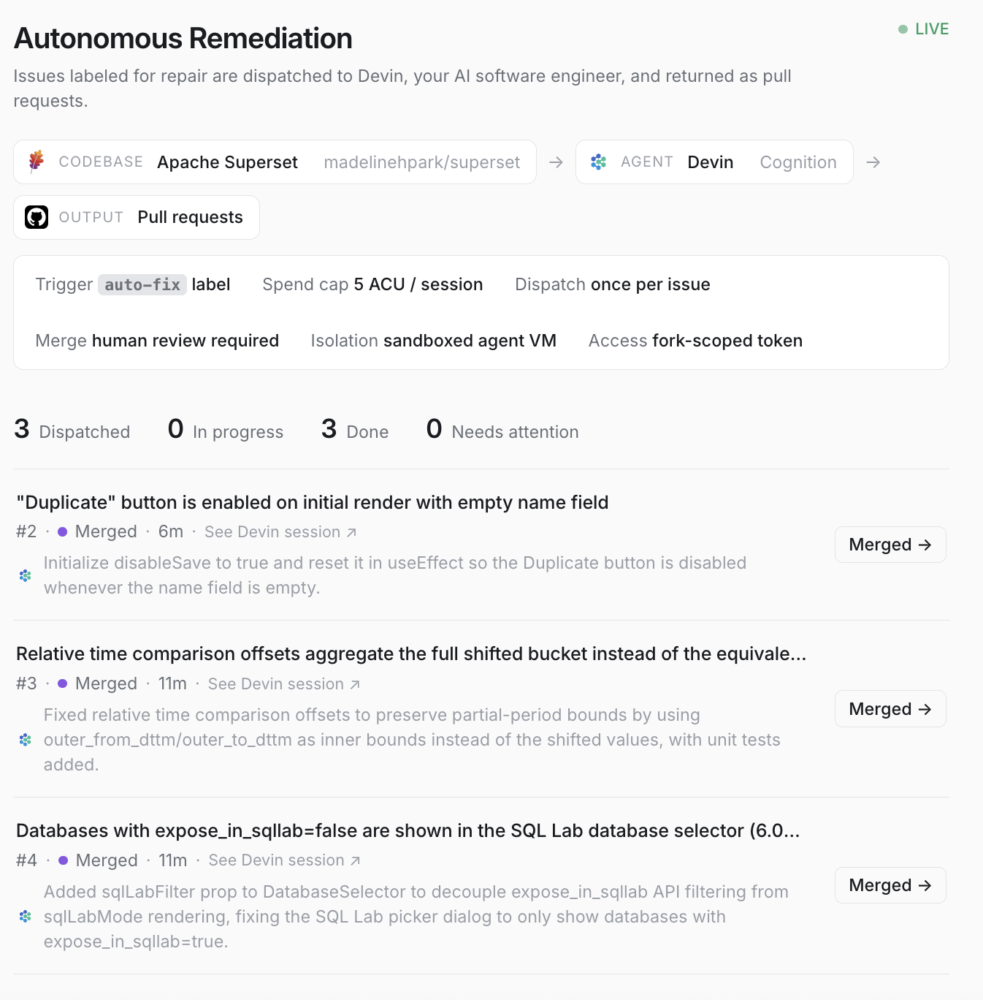

# Devin Auto-Remediation Orchestrator

**▶ [5-minute demo video](https://www.loom.com/share/82a1dd071bcf447c9a1456fb0d4d7e1d)** — live walkthrough of the pipeline fixing real Superset bugs.

An event-driven pipeline that turns labeled GitHub issues into reviewed pull requests —
autonomously. Label an issue **`auto-fix`**, and the orchestrator dispatches
[Devin](https://devin.ai) (Cognition's AI software engineer) to fix it, tracks the session
to completion, and reports the resulting PR on a live dashboard. PR review comments are
addressed autonomously too; merges stay behind human review.

Proven against a real codebase: three bugs in
[Apache Superset](https://github.com/madelinehpark/superset) (~1.5M LOC) went from
labeled issue to **merged pull request** with no human writing code —
[a frontend validation bug](https://github.com/madelinehpark/superset/pull/8),
[a backend data-correctness regression](https://github.com/madelinehpark/superset/pull/9)
in time-comparison query logic, and
[a cross-component UI regression](https://github.com/madelinehpark/superset/pull/10) whose
root cause was a subtle prop-coupling issue two refactors deep. On the first one,
Devin's automated review caught an edge case the issue's acceptance criteria missed
(an Enter-key handler bypassing validation) and fixed it before any human saw the PR.



## Remediated issues

| Issue (on the fork) | Devin's PR | Outcome |
|---|---|---|
| [#2 — "Duplicate" button enabled with empty name field](https://github.com/madelinehpark/superset/issues/2) | [#8](https://github.com/madelinehpark/superset/pull/8) | **Merged.** Devin's auto-review additionally caught an Enter-key validation bypass the acceptance criteria missed, and fixed it pre-review. |
| [#3 — Relative time comparison offsets aggregate the full shifted bucket](https://github.com/madelinehpark/superset/issues/3) | [#9](https://github.com/madelinehpark/superset/pull/9) | **Merged.** Backend data-correctness fix in query time-offset logic, with unit tests. |
| [#4 — `expose_in_sqllab=false` databases shown in SQL Lab selector](https://github.com/madelinehpark/superset/issues/4) | [#10](https://github.com/madelinehpark/superset/pull/10) | **Merged.** Root cause was filter logic coupled to a layout prop two refactors deep; Devin decoupled them with a dedicated `sqlLabFilter` prop. |

All three are real bugs reported upstream against Apache Superset (apache/superset
#40405, #40501, #40850), verified present in the fork and unfixed at selection time.

## Why an autonomous engineer

The expensive part of most backlog bugs isn't typing the fix — it's reproducing the
problem in a running app, tracing the cause, and verifying the change. For the SQL Lab
regression above, that meant standing up Superset, configuring databases with the flag
set both ways, and checking a dropdown before and after — work Devin did end-to-end in
its own sandbox, including watching the fix behave in the live app.

That changes the economics in three ways:

- **Delegation, not supervision.** Each issue here had an objective done-condition, so
  the agent could be dispatched and left alone. Three issues ran as a fleet; the human
  role collapsed to reviewing three PRs. An in-IDE assistant produces the same diffs —
  with you in the chair the whole time, one bug at a time.
- **The loop closes itself.** Devin's automated review caught an edge case the issue's
  own acceptance criteria missed (an Enter-key handler bypassing validation) and fixed
  it before any human saw the PR. Review comments on its PRs are addressed
  autonomously — feedback becomes a one-sentence reply, not a context switch.
- **Bounded, visible cost.** Every session is ACU-capped, every fix shows what it cost
  on the dashboard, and merges stay behind human review. "Labeled = delegated" is safe
  precisely because the guardrails are structural, not behavioral.

The honest boundary: this works for well-scoped, verifiable work — regressions,
validation gaps, bugs with reproduction steps. Ambiguous or architectural problems
still belong to humans. The point of the pipeline is that the well-scoped majority of
a backlog no longer has to wait for one.

```
                 ┌────────────────────────────────────────────────────────┐
                 │                      orchestrator                      │
GitHub issues ──▶│  poll `auto-fix` label ──▶ dispatch Devin session      │
 (label event)   │  poll session w/ backoff ──▶ track to completion       │──▶ pull request
                 │  watch for PR review feedback ──▶ Devin re-engages     │    (human review,
                 │  mirror PR merge state                                 │     then merge)
                 └──────────────────────┬─────────────────────────────────┘
                                        ▼
                          state/*.json ──▶ live dashboard
                          (results, activity feed, config)
```

## Quick start — simulate the workflow (zero credentials)

```bash
docker compose up --build
# dashboard: http://localhost:8080/dashboard/
```

Mock mode runs the full pipeline with no network calls to Devin and no GitHub token:
three canned issues are dispatched concurrently and exercise the happy path, the
slow path, and the blocked path — so you'll see every dashboard state (in progress
with live narration, done with a PR link, and needs-attention) plus the activity
feed, within about two minutes. The dashboard shows an amber **SIMULATION** badge
so mock mode is never mistaken for live.

Without Docker:

```bash
python3 -m venv .venv && .venv/bin/pip install -r requirements.txt
.venv/bin/python orchestrator.py &
.venv/bin/python -m http.server 8080
# http://localhost:8080/dashboard/
```

## Run it for real

Prerequisites: a Devin account with API access (service-user key + org id), the Devin
GitHub app installed on the target repo, and a GitHub fine-grained PAT scoped to that
repo (Issues r/w, Pull requests r/w, Contents read).

```bash
cp .env.example .env     # fill in DEVIN_API_KEY, DEVIN_ORG_ID, GITHUB_TOKEN, GITHUB_REPO
                         # set DEVIN_MODE=real
docker compose up --build
```

Then label any open issue in the target repo with **`auto-fix`**. Within one poll
interval the orchestrator dispatches a Devin session (hard-capped at `MAX_ACU_LIMIT`
ACUs); the dashboard row tracks Devin's own progress narration live, links to the
session, shows the PR the moment it opens, and flips to *Done* when the work is
delivered. Comment on the PR and the row flips to *Addressing review* while Devin
handles it; merge it and the row turns purple *Merged* within a poll cycle.

## Architecture

| File | Role |
|---|---|
| `orchestrator.py` | Main loop: fetch labeled issues → dedupe (`state/processed.json`) → one tracked Devin session per issue, concurrently → results, activity events, and live config published to `state/` for the dashboard. Follow-up watcher detects PR-review re-engagement; PR merge state is mirrored each cycle. |
| `devin_client.py` | One interface, two implementations. `RealDevinClient`: Devin API v3 (Bearer auth, ACU cap, structured-output schema, idempotent create, capped-backoff polling, progress narration from the session message stream). `MockDevinClient`: byte-compatible no-network stand-in with deterministic happy/slow/blocked scenarios, synced to observed live-API behavior. |
| `github_client.py` | Issue polling (label-filtered, PRs excluded, paginated) + PR state lookups. `MockIssueSource` provides canned issues when no token is configured. |
| `dashboard/` | Single static page (no framework): per-issue status with live agent narration, session links, PR buttons, ACU spend, elapsed time, totals, and a timestamped activity feed. |

## Design decisions (learned against the live API)

- **Polling, not webhooks.** The Devin API exposes no webhook surface, so sessions are
  polled with exponential backoff capped at 30s. The system is still event-driven where
  it counts: the GitHub label is the event.
- **Completion = PR URL delivered, not "output exists."** Devin initializes its
  structured output early and fills it in incrementally; treating any output as
  completion produced false "done" states. Completion is gated on the PR URL (or a
  truly terminal session state: `blocked`, `suspended`, `expired`, `stopped`).
- **A "finished" session isn't over.** Devin keeps the session alive to address PR
  review comments. A lightweight watcher detects re-engagement (`status_detail`
  flipping back to `working`) and surfaces it as *Addressing review*.
- **Dispatch exactly once.** Processed issue numbers persist across restarts; re-running
  an issue is an explicit operator action (delete it from `state/processed.json`).
  Devin-side `idempotent: true` adds API-level protection (set `IDEMPOTENT=false` to
  force a fresh session — note the dedupe window is short).
- **Survive flaky networks.** Transient errors are one-line warnings with retries at
  both the HTTP layer (urllib3 `Retry`) and the polling loop (5 consecutive failures
  before giving up); a wifi blip can't kill a 30-minute session track.
- **Guardrails by default:** per-session ACU spend cap, once-per-issue dispatch, merges
  gated on human review, fork-scoped fine-grained token, agent isolated in Devin's
  sandbox. The dashboard renders the *live* config, not aspirational values.

## Configuration

| Variable | Default | Purpose |
|---|---|---|
| `DEVIN_MODE` | `mock` | `mock` = no credentials, no network to Devin; `real` = live sessions (spends ACUs) |
| `DEVIN_API_KEY` / `DEVIN_ORG_ID` | — | Devin v3 service-user key (`cog_…`) + org id |
| `GITHUB_TOKEN` / `GITHUB_REPO` | — | Fine-grained PAT + `owner/name`; unset token = canned mock issues |
| `ORCHESTRATOR_LABEL` | `auto-fix` | Issues carrying this label get dispatched |
| `MAX_ACU_LIMIT` | `5` | Hard spend cap passed to every Devin session |
| `POLL_INTERVAL` | `30` | Seconds between GitHub polls |
| `IDEMPOTENT` | `true` | Devin-side prompt dedupe on session create |

## Operational notes

- **Run exactly one orchestrator per state directory.** Results are persisted
  whole-file from memory; two writers (e.g. a local process plus the Docker stack)
  will fight over `state/`.
- **Local mock testing on a machine that has a real `.env`:** Docker Compose reads
  `.env` for variable interpolation, so plain `docker compose up` will poll your real
  repo (with the mock Devin). Use `GITHUB_TOKEN= docker compose up` to force the
  canned issues. A fresh clone has no `.env`, so the zero-credential quick start
  behaves as documented for reviewers.
- **Re-running an issue** is an explicit operator action: remove its number from
  `state/processed.json` and restart (set `IDEMPOTENT=false` if you want a genuinely
  fresh session rather than Devin's prompt-level dedupe).

## Tests

```bash
.venv/bin/pip install pytest && .venv/bin/pytest
```

Covers the dispatcher's dedupe logic and the mock client lifecycle (including the
incremental-output completion semantics learned from the live API).
